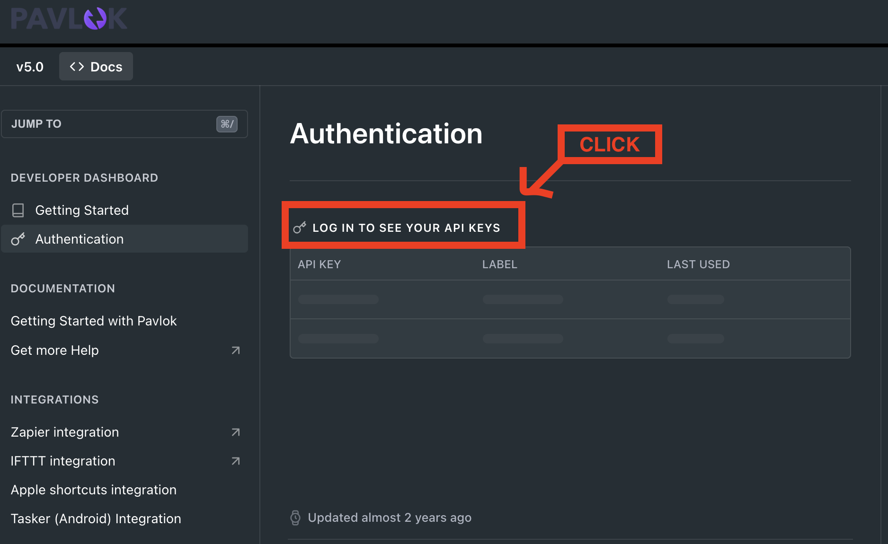
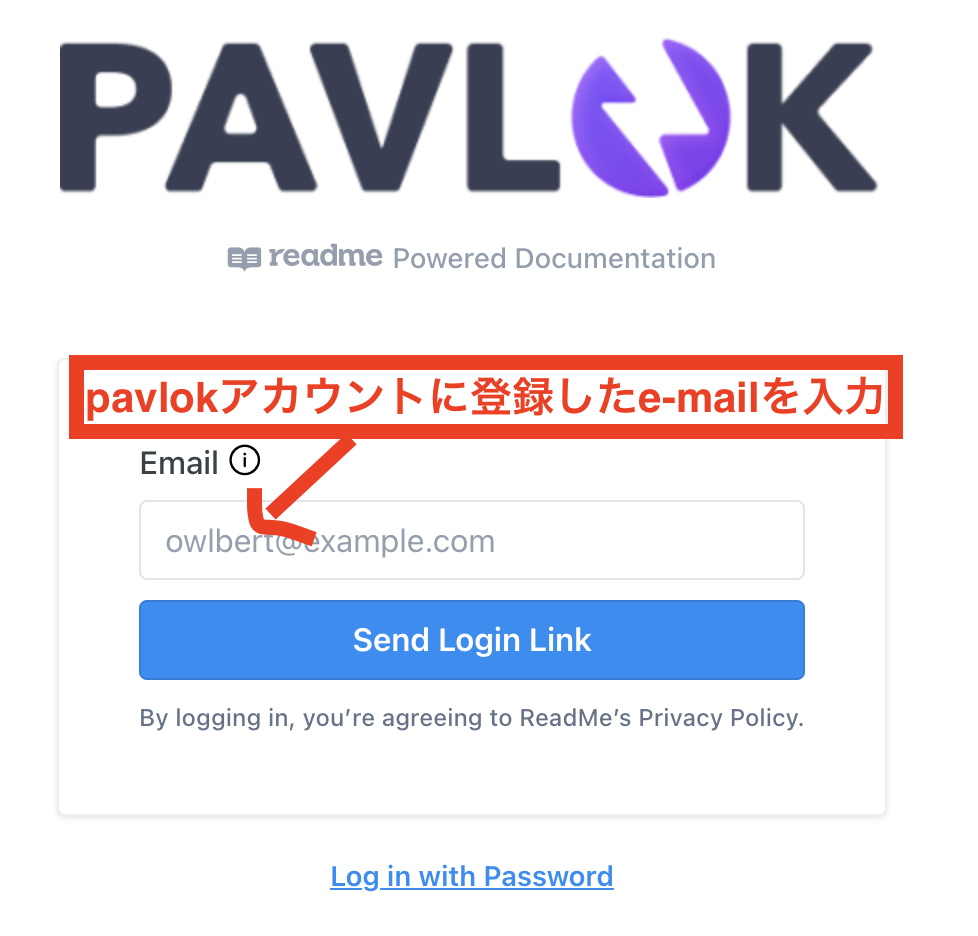
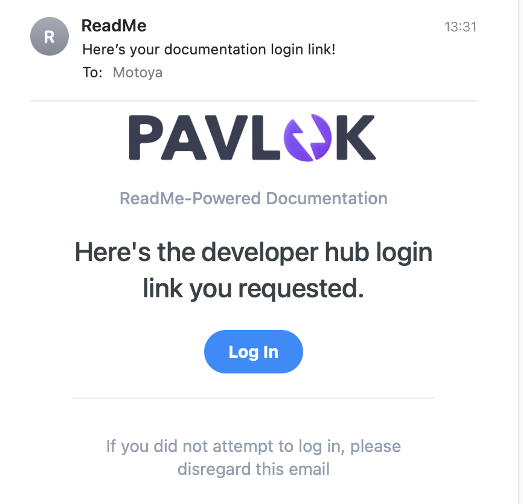
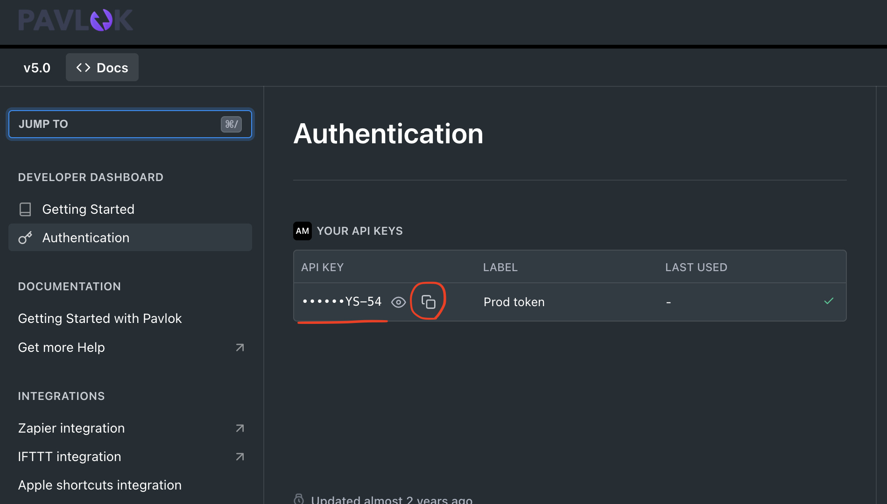

# pavlok_CLI_agent
CLI agentにpavlokを使用させたらどうなるか自傷実験

## 導入
### 1. pavlok本体を購入します
- [日本代理店](https://www.pavlok-japan-official.com/top)
- [本社](https://www.pavlok.com/)

### 2. `pavlokアカウント新規作成` & `pavlok本体とアカウント紐付け`を行います
   - [解説動画](https://video.wixstatic.com/video/3cbb88_fafe1dda81a346d48023698dbda68355/1080p/mp4/file.mp4)
### 3. pavlok公式サーバーから`API_KEY`を取得します
1. [pavloc公式_APIDOC](https://pavlok.readme.io/reference/intro/authentication)にアクセスします
2. `Log in to see your API keys`をクリックします
   
3. メールアドレスを入力し、`Send LogIn Link`をクリックします
   
4. メールが届くので`Log In`をクリックします
 
5. Authページに`API_KEY`が表示されているのでコピーします **prefixの`Bearer `を除いたものが`PAVLOK_API_KEY`です**
   
### 4. レポジトリのクローン
```bash
cd {your dir}
git clone https://github.com/motoya0118/pavlok_CLI_agent.git
```
### 5. .envの設定
```bash
echo 'PAVLOK_API_KEY=YOUR_API_KEY' > .env
```