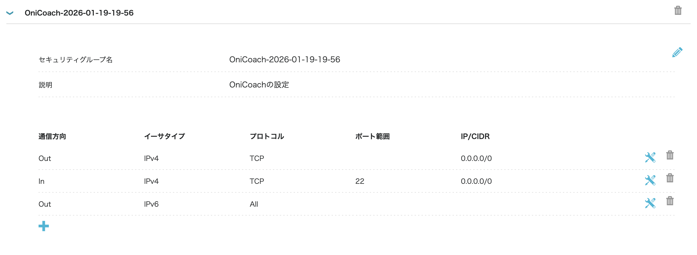
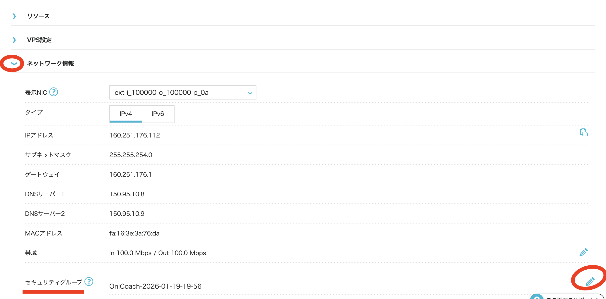

## 推奨サービス
[conoha VPS](https://vps.conoha.jp/?btn_id=pricing--commonHeader_vps-top&_gl=1*17khob2*_gcl_au*MTcxMDUxMDY5MC4xNzY4ODE4NTg3LjY5OTg1NTkxNS4xNzY4ODE5MTE1LjE3Njg4MjA4MjU.*_ga*NDEzNzczNDIwLjE3Njg4MTg1ODc.*_ga_261Y08RR47*czE3Njg4MTg1ODckbzEkZzEkdDE3Njg4MjA5MzkkajU0JGwwJGgw&_ga=2.16587830.1656599378.1768818587-413773420.1768818587)
- プラン: メモリ1GB
- 費用: 約1000円

## 詰まりポイント
### sshするまで
- セキュリティグループがIN/OUT全部非解放なので手動で解放する必要がある


- 更に1サーバーごとにつけれるセキュリティグループは1つなのでdefaultから👆で作ったのに変更する必要がある



### ssh接続してセキュアな接続のみ許可する

```markdown
## 全体像（30秒で俯瞰 👀）

1. ConoHaで **IP / rootパスワード確認**
2. ローカルから **SSH接続**
3. **一般ユーザー作成（超重要）**
4. sudo & SSH鍵設定
5. rootログイン封印（推奨）

---

## 1️⃣ ConoHaで情報確認

ConoHa の管理画面で👇を確認

* 🌐 **グローバルIP**
* 🔑 **rootパスワード**
* 🐧 OS：Ubuntu 20.04 / 22.04（多分）

---

## 2️⃣ まずは root でSSH接続（初回だけ）

```bash
ssh root@<VPSのIP>
```

初回は Yes 聞かれる👇

```text
Are you sure you want to continue connecting (yes/no)?
→ yes
```

パスワード入力（画面に出ないのは正常）

✅ ここまで来たら勝ち 🎉

---

## 3️⃣ 一般ユーザー作る（※必須）

root常用は事故るので即やる 🔥

```bash
adduser motoya
```

* パスワード設定
* 他は全部 Enter でOK

sudo権限付与👇

```bash
usermod -aG sudo motoya
```

---

## 4️⃣ 一般ユーザーで入り直す

```bash
exit
ssh motoya@<VPSのIP>
```

sudo確認👇

```bash
sudo ls
```

通ればOK 👍

---

## 5️⃣ SSH鍵ログインに切り替える（超おすすめ🔐）

### ローカルで鍵作ってないなら

```bash
ssh-keygen -t ed25519
```

### VPSに鍵を送る

```bash
ssh-copy-id motoya@<VPSのIP>
```

以降👇

```bash
ssh motoya@<VPSのIP>
```

パスワード不要 ✨

---

## 6️⃣ rootログインを禁止（安全度UP）

```bash
sudo nano /etc/ssh/sshd_config
```

以下を修正👇

```text
PermitRootLogin no
PasswordAuthentication no
UsePAM no
```

反映👇

```bash
sudo systemctl restart ssh
```

⚠️ **別ターミナルで motoya ログイン確認してから** やること
（閉め出し事故防止😇）

---
```
